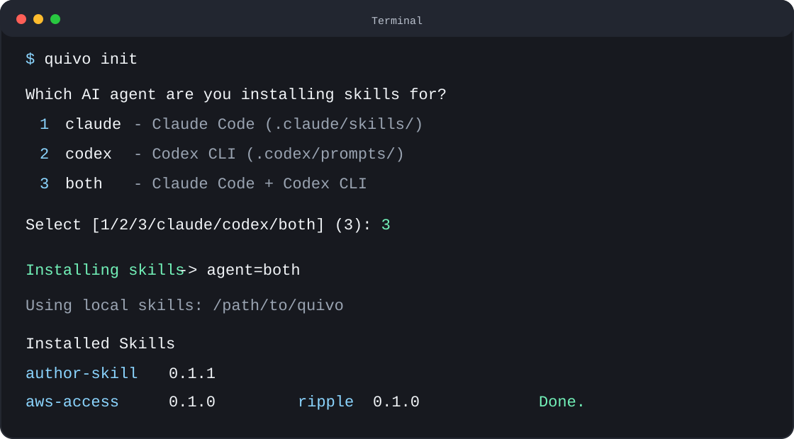

# quivo 길라잡이

<p align="center">
  한국어 · <a href="./GUIDE.md">English</a>
</p>

이 문서는 quivo를 처음 쓰는 사람이 설치, 스킬 설치, 동기화, 로컬 테스트까지
순서대로 따라 할 수 있도록 만든 사용 길라잡이입니다.

README가 quivo의 개념과 큰 흐름을 설명한다면, 이 문서는 실제로 손에 잡히는
명령어와 확인 방법에 집중합니다.

## 용어 먼저 보기

| 용어 | 뜻 |
|------|----|
| quivo CLI | `quivo init`, `quivo sync` 같은 명령을 제공하는 도구 |
| 스킬 저장소 | 회사나 개인이 관리하는 `skills/` 폴더가 있는 quivo 레포 |
| 대상 프로젝트 | Claude Code나 Codex에서 스킬을 쓰려는 실제 작업 폴더 |
| agent | 스킬을 설치할 대상 도구입니다. `claude`, `codex`, `both` 중 하나를 고릅니다. |
| release 모드 | GitHub Release에 올라간 스킬 번들을 받아 설치하는 기본 방식 |
| local 모드 | 현재 디스크의 quivo 체크아웃에서 바로 스킬을 설치하는 개발/오프라인 방식 |

## 준비물

- Python 3.10 이상
- `uv` 권장
- GitHub Release에서 스킬을 받을 경우 네트워크 접근
- 비공개 저장소를 쓸 경우 `GH_TOKEN` 또는 `GITHUB_TOKEN`

Python 버전은 다음으로 확인합니다.

```bash
python3 --version
```

`uv`가 없다면 설치합니다.

```bash
curl -LsSf https://astral.sh/uv/install.sh | sh
```

설치 후 터미널을 새로 열거나 shell 설정을 다시 로드합니다.

## 일반 사용자가 quivo 설치하기

가장 추천하는 방식은 `uv tool install`입니다. 이 방식은 `quivo` 명령을 PATH에
등록해서 어느 폴더에서든 실행할 수 있게 합니다.

```bash
uv tool install git+https://github.com/chordpli/quivo.git
quivo --version
```

`pipx`를 쓰는 팀이라면 다음도 가능합니다.

```bash
pipx install git+https://github.com/chordpli/quivo.git
quivo --version
```

설치 없이 한 번만 실행해보고 싶다면 `uvx`를 씁니다.

```bash
uvx --from git+https://github.com/chordpli/quivo.git quivo --version
```

## 프로젝트에 스킬 설치하기

스킬을 쓰려는 프로젝트 폴더로 이동합니다.

```bash
cd /path/to/your/project
```

가장 간단한 시작은 옵션 없이 실행하는 것입니다.

```bash
quivo init
```

그러면 CLI가 어떤 agent에 설치할지 물어봅니다. 기본값은 `3`, 즉 `both`입니다.
그대로 Enter를 누르면 Claude Code와 Codex 둘 다에 설치됩니다.



선택지는 다음과 같습니다.

| 선택 | 입력값 | 설치 위치 |
|------|--------|-----------|
| `1` | `claude` | `.claude/skills/q-<name>/` |
| `2` | `codex` | `.agents/skills/q-<name>/` |
| `3` | `both` | Claude Code와 Codex 둘 다 |

자동화 스크립트나 문서에서 대화형 선택을 피하고 싶다면 `--agent`를 직접 지정합니다.

Claude Code와 Codex 둘 다에 설치하려면 다음을 실행합니다.

```bash
quivo init --agent both
```

Claude Code에만 설치하려면 다음을 실행합니다.

```bash
quivo init --agent claude
```

Codex에만 설치하려면 다음을 실행합니다.

```bash
quivo init --agent codex
```

설치가 끝나면 대상 프로젝트에 다음 파일들이 생깁니다.

```text
.claude/skills/q-<skill-name>/SKILL.md
.agents/skills/q-<skill-name>/SKILL.md
CLAUDE.md          # quivo 스킬 목록 관리 블록
AGENTS.md          # quivo 스킬 목록 관리 블록
.quivo-lock.json
```

`.quivo-lock.json`은 현재 프로젝트에 어떤 스킬이 어떤 버전으로 설치되었는지
기록하는 파일입니다.

## 설치된 스킬 확인하기

대상 프로젝트에서 다음을 실행합니다.

```bash
quivo list
```

다른 폴더를 지정해서 확인하려면 `--dir`을 씁니다.

```bash
quivo list --dir /path/to/your/project
```

## 스킬 최신화하기

스킬 내용만 최신 버전으로 갱신하려면 다음을 실행합니다.

```bash
quivo sync
```

특정 프로젝트를 지정하려면 다음처럼 실행합니다.

```bash
quivo sync --dir /path/to/your/project
```

이미 파일이 있고 quivo가 덮어쓰기를 거부하면, 내용을 확인한 뒤 필요할 때만
`--force`를 붙입니다.

```bash
quivo sync --force
```

## CLI 자체 업그레이드하기

스킬이 아니라 quivo CLI 자체를 업그레이드하려면 다음을 실행합니다.

```bash
quivo update
```

헷갈리지 않게 구분하면 이렇습니다.

| 하고 싶은 일 | 명령어 |
|--------------|--------|
| 설치된 스킬 내용 갱신 | `quivo sync` |
| quivo 명령줄 도구 업그레이드 | `quivo update` |

## 회사 저장소로 쓰기

회사에서 쓰려면 이 레포를 포크하거나 private repo로 복사한 뒤 `quivo.yml`의
`repo` 값을 회사 저장소로 바꿉니다.

```yaml
repo: my-company/quivo
```

그 다음 `skills/`에 회사 스킬을 넣고, `skills/VERSION`을 올린 뒤 GitHub Actions로
`skills-v*` 릴리스를 발행합니다.

엔지니어는 회사 저장소에서 CLI를 실행합니다.

```bash
uvx --from git+https://github.com/my-company/quivo.git quivo init --agent both
```

비공개 저장소라면 토큰을 설정합니다.

```bash
export GH_TOKEN=github_pat_...
```

또는 CLI가 물어볼 때 토큰을 입력해도 됩니다. 입력한 토큰은 `~/.quivo/token`에
저장됩니다.

## 새 스킬 추가하기

회사 저장소에서 가장 자주 하는 유지보수 작업은 `skills/` 아래에 새 스킬을 추가하는
것입니다. 스킬은 하나의 폴더로 관리하고, 최소한 `SKILL.md`와 `skill.yaml`이 필요합니다.

수동으로 직접 만들 수도 있지만, 실제로는 챙길 파일과 검증 단계가 많아서 꽤 복잡합니다.
권장 흐름은 LLM에게 `author-skill`을 사용하게 해서 초안을 만들고, 사람이 목적·트리거
경계·검증 결과를 리뷰하는 방식입니다.

```text
skills/<skill-name>/
  SKILL.md
  skill.yaml
  setup.sh      # 선택
  setup.ps1     # 선택
```

가장 빠르고 안전한 시작은 번들된 `author-skill`을 쓰는 것입니다. Claude Code나 Codex에
quivo 스킬을 설치한 뒤 다음처럼 LLM에게 요청하면 됩니다.

```text
새 quivo 스킬을 추가하고 싶어. 목적은 <무엇>, 호출 시점은 <언제>, 입력은 <무엇>, 출력은 <무엇>이야.
```

아래 수동 절차는 `author-skill`이 만들어준 결과를 검토하거나, 자동화 없이 직접 작성해야 할 때
사용합니다.

1. 스킬 이름을 정합니다.

이름은 kebab-case를 사용합니다.

```bash
export SKILL_NAME="my-new-skill"
mkdir -p "skills/$SKILL_NAME"
```

2. `skill.yaml`을 작성합니다.

```yaml
name: my-new-skill
version: 0.1.0
description: "무엇을 하는 스킬인지, 언제 사용해야 하는지 한두 문장으로 설명한다."
agents: [claude, codex]
internal: false
requires: []
```

`description`은 매우 중요합니다. 에이전트는 이 설명을 보고 어떤 스킬을 자동으로
불러올지 판단합니다. 비슷한 스킬이 있다면 경계를 분명히 써야 합니다.

3. `SKILL.md`를 작성합니다.

`SKILL.md`는 맨 위에 frontmatter가 있어야 하고, 본문에는 필수 섹션이 있어야 합니다.
자세한 표준은 [quivo/skill-template.md](./quivo/skill-template.md)를 따릅니다.

```markdown
---
name: my-new-skill
description: 무엇을 하는 스킬인지, 언제 사용해야 하는지 한두 문장으로 설명한다.
version: 0.1.0
scope: general
agents: [claude, codex]
risk: low
policy_injection: required
outputs: []
---

# My New Skill

> **The Iron Law**: 이 스킬이 절대 깨면 안 되는 핵심 규칙.

You are operating as ...

## When to use

## Inputs

## Process

## Iron Laws

## Failure modes
```

필수 frontmatter 필드는 `name`, `description`, `version`, `scope`, `agents`, `risk`,
`policy_injection`, `outputs`입니다.

필수 본문 섹션은 `## When to use`, `## Inputs`, `## Process`, `## Iron Laws`,
`## Failure modes`입니다.

4. 필요한 경우 셋업 스크립트를 추가합니다.

스킬 실행 전 도구 확인이나 환경 설정이 필요하면 `setup.sh` 또는 `setup.ps1`을 같은
폴더에 둡니다. quivo는 설치할 때 이 파일들을 함께 복사합니다.

5. trigger prompt를 추가합니다.

```bash
mkdir -p tests/skill-triggering/prompts
printf '%s\n' "사용자가 이 스킬을 부를 법한 자연어 요청을 여기에 쓴다." \
  > "tests/skill-triggering/prompts/$SKILL_NAME.txt"
```

prompt에는 가능하면 스킬 이름을 직접 쓰지 않습니다. 실제 사용자가 말할 법한 표현을
넣어야 `description`이 제대로 구분되는지 확인하기 좋습니다.

6. `manifest.json`을 갱신합니다.

로컬 검증과 리뷰를 위해 새 스킬의 version과 sha256을 `manifest.json`에 반영합니다.
GitHub Release workflow도 manifest를 다시 만들지만, PR 단계에서는 로컬 manifest가
맞아야 확인하기 쉽습니다.

```bash
python3 - <<'PY'
import hashlib
import json
import os
from pathlib import Path

name = os.environ.get("SKILL_NAME", "my-new-skill")
skill_dir = Path("skills") / name

combined = b""
for fname in sorted(["skill.yaml", "SKILL.md", "setup.sh", "setup.ps1"]):
    path = skill_dir / fname
    if path.exists():
        combined += path.read_bytes()

sha = hashlib.sha256(combined).hexdigest()

manifest_path = Path("manifest.json")
manifest = json.loads(manifest_path.read_text(encoding="utf-8"))

version = None
for line in (skill_dir / "skill.yaml").read_text(encoding="utf-8").splitlines():
    if line.startswith("version:"):
        version = line.split(":", 1)[1].strip().strip('"')
        break
if version is None:
    raise SystemExit("version not found in skill.yaml")

entry = {"name": name, "version": version, "sha256": sha}
manifest["skills"] = [s for s in manifest["skills"] if s["name"] != name]
manifest["skills"].append(entry)
manifest["skills"].sort(key=lambda s: s["name"])
manifest_path.write_text(json.dumps(manifest, indent=2, ensure_ascii=False) + "\n", encoding="utf-8")
PY
```

7. 스킬 번들 버전을 올립니다.

릴리스할 변경이라면 `skills/VERSION`을 semver로 올립니다.

```bash
echo "0.2.0" > skills/VERSION
```

8. 검증합니다.

```bash
python3 scripts/lint-skills.py
python3 scripts/check-trigger-disambiguation.py
scripts/test-skill.sh "$SKILL_NAME"
```

마지막으로 로컬 설치까지 확인하면 더 좋습니다.

```bash
TMPPROJECT="$(mktemp -d "${TMPDIR:-/tmp}/quivo-skill-test.XXXXXX")"
QUIVO_LOCAL_SKILLS="$PWD" quivo init --agent both --dir "$TMPPROJECT" --no-policy
quivo list --dir "$TMPPROJECT"
```

새 스킬이 Claude Code 쪽 `.claude/skills/q-<skill-name>/`와 Codex 쪽
`.agents/skills/q-<skill-name>/`에 생기면 설치 경로가 정상입니다.

## 로컬 체크아웃에서 바로 설치하기

스킬 릴리스를 만들기 전이거나 오프라인에서 테스트할 때는 `QUIVO_LOCAL_SKILLS`를
사용합니다.

quivo 레포 루트에서 실행하는 예시입니다.

```bash
cd /path/to/quivo
export QUIVO_LOCAL_SKILLS="$PWD"
quivo init --agent both --dir /path/to/test-project --no-policy
```

이 방식은 GitHub Release를 받지 않고 현재 디스크의 `skills/`와 `manifest.json`을
사용합니다.

## 로컬 가상환경에서 전체 동작 검증하기

아래 절차는 이 레포가 실제로 동작하는지 유지보수자가 확인하는 방법입니다.
2026-06-09에 이 절차로 직접 검증했고, 결과는 `27 passed`였습니다.

목표는 세 가지입니다.

- 새 Python 가상환경에 현재 체크아웃을 설치할 수 있는지 확인합니다.
- 단위 테스트가 통과하는지 확인합니다.
- 임시 프로젝트에 스킬을 실제로 설치하고, 목록 조회와 동기화까지 되는지 확인합니다.

먼저 quivo 레포 루트로 이동합니다.

```bash
cd /path/to/quivo
```

임시 가상환경과 임시 설치 대상 프로젝트를 만듭니다.

```bash
TMPBASE="${TMPDIR:-/tmp}"
VENVDIR="$(mktemp -d "$TMPBASE/quivo-venv.XXXXXX")"
SMOKEDIR="$(mktemp -d "$TMPBASE/quivo-smoke.XXXXXX")"
echo "$VENVDIR"
echo "$SMOKEDIR"
```

각 변수의 의미는 다음과 같습니다.

| 변수 | 의미 |
|------|------|
| `VENVDIR` | quivo를 깨끗하게 설치할 임시 Python 가상환경 |
| `SMOKEDIR` | `quivo init`으로 스킬을 설치해볼 임시 프로젝트 |

가상환경을 만듭니다.

```bash
python3 -m venv "$VENVDIR"
```

가상환경 안의 pip를 최신화합니다.

```bash
"$VENVDIR/bin/python" -m pip install --upgrade pip
```

현재 quivo 체크아웃을 편집 가능 모드로 설치하고, 테스트 도구인 `pytest`도 설치합니다.

```bash
"$VENVDIR/bin/python" -m pip install -e . pytest
```

이 명령은 현재 폴더의 `pyproject.toml`을 읽어 quivo와 필요한 의존성을 설치합니다.

단위 테스트를 실행합니다.

```bash
"$VENVDIR/bin/python" -m pytest -q
```

정상이라면 다음처럼 모든 테스트가 통과합니다.

```text
27 passed
```

설치된 CLI가 실행되는지 확인합니다.

```bash
"$VENVDIR/bin/quivo" --version
```

예상 출력은 다음 형태입니다.

```text
quivo 0.1.0
```

이제 임시 프로젝트에 스킬을 설치합니다.

```bash
QUIVO_LOCAL_SKILLS="$PWD" "$VENVDIR/bin/quivo" init --agent both --dir "$SMOKEDIR" --no-policy
```

여기서 중요한 부분은 `QUIVO_LOCAL_SKILLS="$PWD"`입니다. 이 값 때문에 quivo가
GitHub Release를 다운로드하지 않고 현재 레포의 로컬 스킬을 그대로 사용합니다.
`--no-policy`는 회사 정책 주입을 생략해서 순수한 설치 결과만 확인하려는 옵션입니다.

정상이라면 `author-skill`, `aws-access`, `ripple`이 설치된 표가 출력됩니다.

설치된 목록을 다시 확인합니다.

```bash
"$VENVDIR/bin/quivo" list --dir "$SMOKEDIR"
```

스킬 동기화 명령도 확인합니다.

```bash
QUIVO_LOCAL_SKILLS="$PWD" "$VENVDIR/bin/quivo" sync --dir "$SMOKEDIR" --no-policy
```

방금 설치한 직후라면 다음처럼 최신 상태라고 나오는 것이 정상입니다.

```text
All skills are up to date.
```

마지막으로 실제 파일이 만들어졌는지 확인합니다.

```bash
test -f "$SMOKEDIR/.claude/skills/q-author-skill/SKILL.md"
test -f "$SMOKEDIR/.agents/skills/q-author-skill/SKILL.md"
echo "smoke files ok"
```

정상이라면 다음이 출력됩니다.

```text
smoke files ok
```

검증이 끝난 뒤 임시 폴더를 지우려면 다음을 실행합니다.

```bash
rm -rf "$VENVDIR" "$SMOKEDIR"
```

## 실제 검증 기록

이 문서를 만들기 직전에 같은 방식으로 로컬에서 확인한 결과입니다.

| 항목 | 결과 |
|------|------|
| Python | 3.11.7 |
| 가상환경 | `/private/tmp/quivo-venv.kEAk03` |
| 임시 프로젝트 | `/private/tmp/quivo-smoke.VARgUf` |
| 설치 방식 | `pip install -e . pytest` |
| 단위 테스트 | `27 passed` |
| CLI 버전 확인 | `quivo 0.1.0` |
| 스모크 테스트 | `init`, `list`, `sync`, 파일 존재 확인 모두 성공 |

## 문제 해결

| 증상 | 확인할 것 |
|------|-----------|
| `quivo` 명령을 찾을 수 없음 | `uv tool install ...`을 다시 실행하거나 새 터미널을 엽니다. |
| `pytest`가 없음 | 가상환경 안에서 `"$VENVDIR/bin/python" -m pip install -e . pytest`를 실행했는지 확인합니다. |
| GitHub API 오류 | 비공개 저장소라면 `GH_TOKEN` 또는 `GITHUB_TOKEN`을 설정합니다. |
| 릴리스 다운로드 없이 테스트하고 싶음 | `QUIVO_LOCAL_SKILLS="$PWD"`를 붙여 local 모드로 실행합니다. |
| 기존 파일과 충돌 | 대상 프로젝트의 기존 `.claude/skills`, `.agents/skills` 파일을 확인한 뒤 필요하면 `--force`를 사용합니다. |
| `quivo sync`가 실패 | 대상 프로젝트에 `.quivo-lock.json`이 있는지 확인합니다. 없다면 먼저 `quivo init`을 실행합니다. |

## 다음에 읽을 문서

- [README.ko.md](../README.ko.md): quivo의 개념과 전체 소개
- [quivo/fork-guide.md](./quivo/fork-guide.md): 회사용 포크를 만드는 자세한 절차
- [quivo/skill-template.md](./quivo/skill-template.md): 새 스킬 작성 템플릿
- [quivo/permissions.md](./quivo/permissions.md): 스킬 권한 모델
